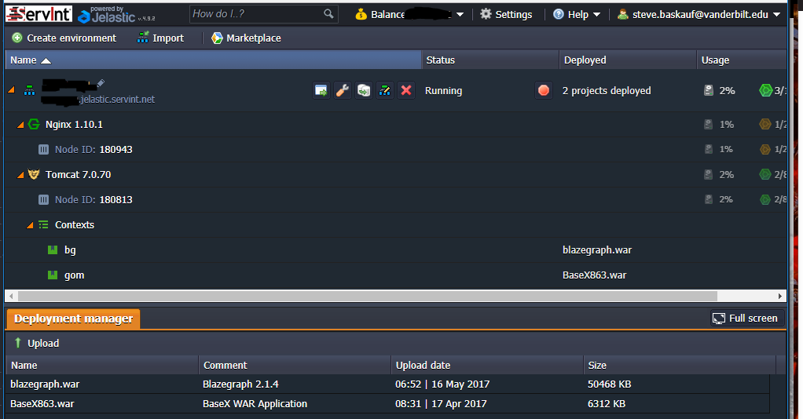
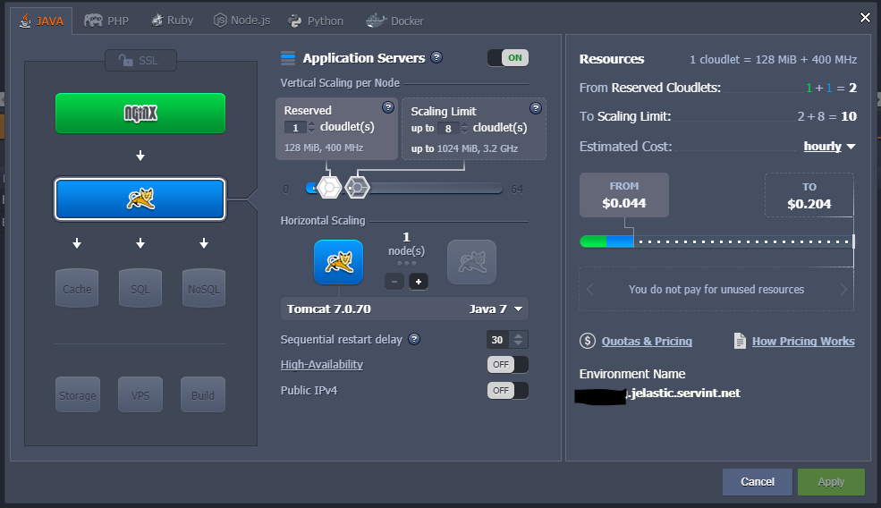

# Setting up your own SPARQL endpoint
**Vanderbilt University Semantic Web Working Group**

[back to the User Guide](README.md)

[go to the SPARQL query interface](https://sparql.vanderbilt.edu/#query)

## How hard is it to set up a SPARQL endpoint?

This simple-sounding question does not have a simple answer.  If you want to just play around with your own SPARQL endpoint, it isn't really vwery hard to set one up.  On the other hand, if you want to set up a permanent, secure SPARQL endpoint exposed to the public, things are considerably more complicated. This page will not provide setup details, but rather present the issues you should consider before trying it yourself.

## Easy: I just want to set up a SPARQL endpoint on my desktop computer and play with it

There are several graph database/SPARQL endpoint applications that you can try out for free.  We have experimented with Callimachus, Stardog, and Blazegraph.  There are probably other good options that we haven't tried.  There are some setup instructions for those three applications [here](http://baskauf.blogspot.com/2017/02/sparql-weirdness-of-unnamed-graphs.html). There are also some performance-related comments [here](http://baskauf.blogspot.com/2016/02/stress-testing-stardog-reasoner.html) and [here](http://baskauf.blogspot.com/2016/10/linked-data-magic-and-big-data.html).  In the end, we chose to use Blazegraph for several reasons:

1. It is satisfactorily fast (vs. Callimachus which both loaded and ran much more slowly)
2. The free community version of Stardog is limited to 25 million triples.  That sounds like a lot, but it would be relatively easy to go over that with a modest sized dataset.  The open source version of Blazegraph supports 50 billion triples.
3. There are some technical details of how Stardog handles named graphs that were undesirable (details [here](http://baskauf.blogspot.com/2017/02/sparql-weirdness-of-unnamed-graphs.html)).
4. Wikidata does cool things with Blazegraph and we might want to try to replicate them some day.

Once one sets up a local installation of one of these applications, it can be loaded with triples using a graphical interface and queried either by typing the queries into a query interface box or by using HTTP GET to a localhost: URI.  

This is fine for playing around and learning, but is probably inadequate for any kind of group effort since the installation cannot be accessed beyond one particular computer.

## Medium: I want to set up a SPARQL endpoint that will be accessible online, but not be advertised to the public

Over the past several years, we have had several test installations of SPARQL endpoints hosted by Vanderbilt's Heard Library with some minimal IT support provided by the library.  However, we wanted to set up a university-wide endpoint that was not specifically associated with the library.  That turned out to be administratively complex and in the end we set up the system on a commercial cloud-hosting service.  There are many cloud-hosting options available.  We chose a Jelastic-based service because it's graphical interface was easier for us to figure out. Here's what it looks like:

Here's what the scaling interface looks like:

As relatively tech-savvy people who were not server professionals, we were able to set up the server relatively quickly.  There's a "create environment" button to set up a Tomcat server.  After setting up the server, we deployed the Blazegraph .war file from the [here](https://sourceforge.net/projects/bigdata/files/bigdata/2.1.1/).   Soon after, we were able to access the Blazegraph web interface by loading into a browser the URI formed by concatenating the subdomain that we set up during the creation of the environment with the subpath of the context we set up for the Blazegraph .war deployment.  

One issue with Blazegraph is that unlike Callimachus and Stardog, it doesn't come out of the box with user authentication for writing to the graph database.  By default, Blazegraph includes a tab for carrying out SPARQL Update commands for writing and deleting, as well as GUI-based file loading.  If no one but the members of your group knows the URI of the endpoint, this is fine, but if you publicize the URI, anyone on the planet can load data into your database or drop graphs from it.  The single Tomcat server instance supports HTTP out of the box, but not HTTPS.  So communications with the endpoint are not secure.  If you want to go public with your endpoint, you will fall into the next category.

## Hard: I want to set up a stable and secure public SPARQL endpoint

Figuring out how to do the setup to make Blazegraph read-only for the public and write with authentication was beyond the skill of the amateurs in our working group, so we hired a developer to help us with the setup.  In the end, we had a system with an Nginx front-end server to handle the interactions with the outside world and the Tomcat back-end to run Blazegraph. To prevent the general public from writing or deleting, we set the server up to allow only HTTP GET interactions without authentication.  (SPARQL Update requires HTTP POST interactions.)  We also edited the Blazegraph web interface to suppress the tab for the Update GUI.  Writing to and deleting from the triplestore is accomplished solely through authenticated HTTP POST requests (no GUI support).  Setting up HTTPS was relatively easy since Jelastic makes it easy to set up a free Let's Encrypt SSL certificate.  There are some more detailed setup instructions [here](https://github.com/kopolzin/vuswwg-web-server).  

One complication to this whole effort was that we wanted the endpoint to have a [Cool URI](https://www.w3.org/TR/cooluris/) that would be stable if we decided to run the endpoint from a different server or used some endpoint application other than Blazegraph.  If we didn't care about having a cool URI, we could have just exposed the URI provided by the cloud hosting service.  However, we wanted to use the stable URI https://sparql.vanderbilt.edu/sparql for the endpoint so that client applications built to use our service wouldn't break if we changed the server hosting or application.  First we had to get approval to use the subdomain sparql.vanderbilt.edu .  Then after we set up the front and back end servers, we needed to figure out where within Vanderbilt IT to make the request to create an A record that associated sparql.vanderbilt.edu with the IP address of the cloud server.  Then we had to ask why the DNS record didn't proliferate outside of Vanderbilt.  After that we could set up HTTPS.  These administrative steps took days.  We also made changes to the server configuration to eliminate any subpaths in the URI between the subdomain and the final "sparql" in the URI.  

There is no possible way that we mere mortals could have figured this out without the help of our developer friend.  

## What does this cost?

The Jelastic system bases the cost rate on a combination of resources deployed and server traffic.  Before loading data into the endpoint, the cost for running a single deployed Tomcat instance was about $1.50 per day with little or no traffic.  After loading about 2 million triples into the database, the cost went up to about $2.00 per day with little or no traffic.  We will see what happens to the cost if traffic picks up significantly, or if we load a lot more data into the triplestore.  

[back to the User Guide](README.md)

[go to the SPARQL query interface](https://sparql.vanderbilt.edu/#query)
