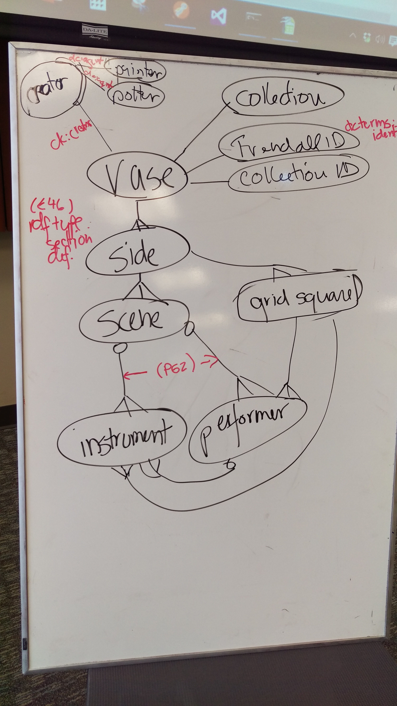

# Resource Links for a Cultural Heritage Dataset: Music and Vase-Painting
Spring 2017 sessions of the Semantic Web Working Group

For background, see [this page from our website](https://github.com/HeardLibrary/semantic-web/blob/gh-pages/posts/2017-01-09.md).  It provides a description of the fields in the source data table.

## Data model

Here's the preliminary data model that we are working with:



## Controlled Vocabularies and SKOS

[PowerPoint from March 13](skos-thesaurus.pptx)

## Running SPARQL queries on the vase dataset and the scene controlled vocabulary; named graphs

[PowerPoint from March 27](named-graphs.pptx)

## Ways to discover data by following your nose, or acquiring metadata about an entire dataset

[PowerPoint from April 3](discovering-data.pptx)

## vocabularies

**CIDOC CRM**

Note: there seems to be two alternate realities for the CDOC-CRM website.  One is based on http://www.cidoc-crm.org and the other is based on http://cidoc-crm.org.  The "www" version (labeled "trial version") has the hyperlinked term definitions.  

[Introduction](http://cidoc-crm.org/comprehensive_intro.html)

[Graphical representation of class hierarchy](http://cidoc-crm.org/cidoc_graphical_representation_v_5_1/class_hierarchy.html)

[Hyperlinked list of classes and properties (most recent published version 6.2.1)](http://www.cidoc-crm.org/Version/version-6.2.1)

[Most recent draft (6.2.1) encoded in RDFS (RDF/XML serialization)](http://cidoc-crm.org/rdfs/cidoc_crm_v6.2.1-draft-b-2015October.rdfs) Note that the xml:base declaration indicates the URI for the ontology: http://www.cidoc-crm.org/cidoc-crm/, which I've been representing with the CURIE crm: .

[PDF version of most recent published draft (6.2.1)](http://www.cidoc-crm.org/sites/default/files/cidoc_crm_version_6.2.1.pdf) This has the most exhaustive descriptions of the terms.

**Dublin Core**

[DCMI Metadata terms index](http://dublincore.org/documents/dcmi-terms/)

Notes:
- terms in the legacy dc: namespace ( 	http://purl.org/dc/elements/1.1/) may all be appropriately used with literal values.  For example: dc:creator="Steve Baskauf"
- terms in the dcterms: namespace should be used with literal or non-literal (URI or blank node) values depending on their range declarations.  For example dcterms:creator=<http://orcid.org/0000-0003-4365-3135>
- Dublin Core classes fall into two namespaces.  Some are in the dcterms: namespace (e.g. dcterms:PhysicalResource) but some are in the dctype: (http://purl.org/dc/dcmitype/) namespace (e.g. dctype:PhysicalObject), so check carefully before using.

**Getty Arts and Architecture Thesaurus**

Access [search interface here](http://www.getty.edu/research/tools/vocabularies/aat/)

Notes:
- The aat: namespace is http://vocab.getty.edu/aat/
- The terms are SKOS concepts, so some thought should be put into how to link to them.  The standard way seems to be via dcterms:subject, although there are some other creative uses (misuses?) found in various implementations.
- Example: [aat:300379340](http://vocab.getty.edu/aat/300379340) (grave vases)

## Examples to look at

**Kerameikos.org**

Kerameikos.org (http://kerameikos.org/) is a collaborative LOD project for defining intellectual concepts of pottery, specifically Greek black- and red-figure pottery.  They use CIDOC CRM, some terms they minted, plus other well-known vocabularies.

[Ontology in Turtle](http://kerameikos.org/ontology.ttl)

[Descriptive paper at http://dx.doi.org/10.5281/zenodo.258046](http://dx.doi.org/10.5281/zenodo.258046)

[Example datasets](http://kerameikos.org/datasets)

Here's one of the examples turned into Turtle and cleaned up:
```
@prefix rdf: <http://www.w3.org/1999/02/22-rdf-syntax-ns#>.
@prefix rdfs: <http://www.w3.org/2000/01/rdf-schema#>.
@prefix xsd: <http://www.w3.org/2001/XMLSchema#>.
@prefix crm: <http://www.cidoc-crm.org/cidoc-crm/>.
@prefix dcterms: <http://purl.org/dc/terms/>.
@prefix foaf: <http://xmlns.com/foaf/0.1/>.
@prefix kon: <http://kerameikos.org/ontology#>.
@prefix void: <http://rdfs.org/ns/void#>.

<http://collection.britishmuseum.org/id/object/GAA8055> a crm:E22_Man-Made_Object;
     kon:hasShape <http://collection.britishmuseum.org/id/thesauri/x105177>;
     dcterms:identifier "1836,0224.79";
     dcterms:title "trefoil-mouth oinochoe by The Achilles Painter"@en;
     void:inDataset <http://www.britishmuseum.org/>;
     crm:P108i_was_produced_by _:1;
     crm:P32_used_general_technique <http://collection.britishmuseum.org/id/thesauri/x14796>;
     crm:P45_consists_of <http://collection.britishmuseum.org/id/thesauri/x41443>;
     crm:P50_has_current_keeper <http://kerameikos.org/id/british_museum>;
     foaf:depiction <http://www.britishmuseum.org/collectionimages/AN00492/AN00492888_001_l.jpg>.

_:1 a crm:E12_Production ;
    crm:P7_took_place_at <http://collection.britishmuseum.org/id/place/x30950> ;
    crm:P14_carried_out_by <http://collection.britishmuseum.org/id/person-institution/57106> ;
    crm:P4_has_time-span _:2.

_:2 a crm:E52_Time-Span ;
    crm:P82a_begin_of_the_begin "-0460"^^xsd:gYear ;
    crm:P82b_end_of_the_end "-0430"^^xsd:gYear.
```

## Preliminary drafts of mapping files

[CURIE (namespace) list](https://github.com/HeardLibrary/semantic-web/blob/master/vase/namespace.csv)

[class list](https://github.com/HeardLibrary/semantic-web/blob/master/vase/vase-classes.csv)

[column to predicate mappings](https://github.com/HeardLibrary/semantic-web/blob/master/vase/vase-column-mappings.csv)
